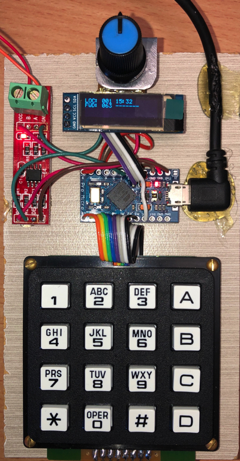
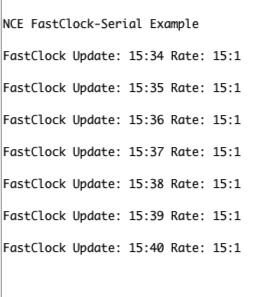

# NceCabBus - NCE Cab Bus Library

The **NceCabBus** library allows you to interface to a NCE Cab Bus via an RS485 Interface and provides examples that implement the following devices:
- Throttle with a 128x32 Pixel OLED Display, a 4x4 Keypad and a Potentiometer Speed knob
- Auxiliary Input Unit (AIU)
- FastClock that outputs the time to the Arduino Serial Port.

The library does not provide the actual RS485 interface - it only provides the logic to process NCE Cab Bus messages,
however the examples show a simple connection to a common RS485 chip and drive the TX Enable directly. 

## Connecting RS485 Transceiver
ASCII schematic of connecting a half-duplex RS485 transceiver e.g. MAX487CSA+ to a microcontroller.
Note: the /RE & TE pins on the RS485 chip are connected together and connect to the Arduino pin 
      defined by RS485_TX_ENABLE_PIN in the examples    

```
----+      
    |      
AVR |                 /|             
    |                / | A           
    |               /  +-------+    
    |          RO  /   |       |    
 RX +-------------+    |       |    
    |              \   | B     |     
    |           /RE o  o---+   *-------------- RS485 A/+ Cab Bus Pin 3
    |               |\ |   |   |     
    |               | \|   |   |     
 TE +---------------*      |   |    
    |               |      |   |    
    |             |\|      |   |    
    |             | + TE   |   |    
    |             |  \   B |   |    
    |          DI |   o----*---|-------------- RS485 B/- Cab Bus Pin 4
 TX +-------------+    \       |     
    |             |     +      |    
    |             |    / A     |    
    |             |   +--------+    
    |             |  /               
    |             |/
    |
GND +--------------------------------------------------- Cab Bus Pin 2
    |               
----+                                                
                                                                   
```

## Development Prototype Pictures 

### OLED Throttle with 4x4 keypad and Potentiometer Speed knob

 

### OLED Throttle and NCE PowerCAB side-by-side

 

### FastClock Serial Output


